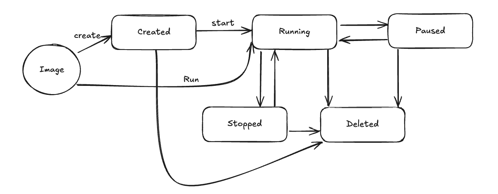
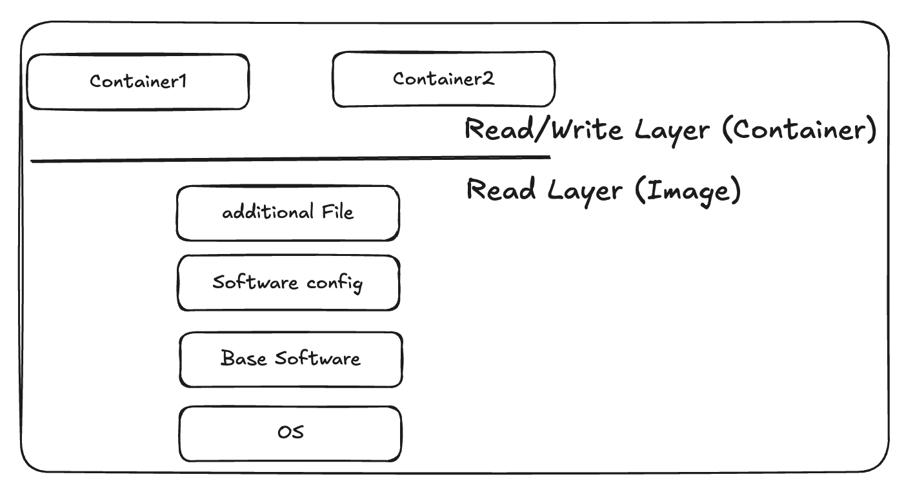

# 📚 스터디 템플릿

## 📖 목차를 읽기 전에 든 생각
- 기본적인 도커의 개념에서 벗어나 실제로 도커의 환경에서 도커 불륨(영속성 저장소), 도커 이미지 레지스트리, 도커 이미지, 그리고 이미지의 레이어가 어떻게 구성되는지를 파악하고 도커에서의 네트워크 환경이 어떻게 서술되어있는지를 위주로 보자.
- 먼저, 한 차례 강의를 통해서 위 개념에 대한 내용을 한 차례 정리해봤으니 서로 비교 검증하며 부족한 부분은 채워나간다.
- 이 부분을 정리를 잘해두어야 쿠버네티스에 대한 이해를 온전히 할 수 있을 것 같다.

## 📝 내용 정리

## 도커의 구조

### 도커 클라이언트
- 도커메 영령을 내릴 수 있는 CLI 도구를 의미힌다. 도커 Client를 사용하여, 컨테이너, 이미지, 볼륨 등을 관리 할 수 있다.
### 도커 호스트
- 도커를 설치한 서버 혹은 가상머신. 물리 서버가 될 수도 있고 가상 서버가 될 수도 있다.
### 도커 레지스트리
- 도커 이미지를 저장하거나 배포하는 시스템, Public Repository와 Private Repository가 있다. 도커 허브는 도커 레지스트리의 한 종류이다.
- 이미지 공유, 이미지 검색, 이미지 버전 관리, 보안, 파이프라인 등을 제공해준다. 

## 이미지
서버에서 어떠한 프로그램이 프로세스가 되기 위해서는 세 가지 도구가 필요하다. 
- OS
- 프로그램이 실행되기 위해서 필요한 구성요소(런타임 도구 등)
- 실행시킬 프로그램

이미지는 특정 시점의 파일 시스템을 저장한 압축 파일이다. 이미지에는 소프트웨어가 필요한 모든 요소를 압축해서 저장하며, 이미지는 윈도우에서 사용하는 백업 기능과 동일하다. (스냅샷과 유사하다.)

## 이미지의 메타데이터
메타데이터가 주 데이터의 데이터를 의미하는 것처럼 이미지의 메타데이터는 이미지의 서브 데이터이다. 
이미지의 메타데이터에는 Id, RepoTags, Env, Cmd, Size등등 여러가지가 있다.  
`docker image inspect {imageName}` 명령어를 통해 이미지의 메타데이터를 확인 할 수 있다.

## 이미지 레지스트리

### 로컬 스토리지
- HOST OS의 로컬 스토리지에서 1순위로 이미지를 검색한다. 퍼블릭 레지스트리에서 이미지를 가져오면 로컬 스토리지에 저장된다.

### 프라이빗 레지스트리
- 특정한 네트워크에서만 접속가능한 레지스트리이다.
- Harbor or docker에 올려서 사용 할 수 있다.

### 이미지 이름 규칙
- ${레지스트리주소}/${프로젝트명}/${이미지명}:${이미지태그}
- 만약 레지스트리 주소가 없다면 도커 허브(docker.io)에서 이미지를 검색한다.

## 컨테이너
- 실행 상태의 이미지를 의미하며 한 개의 이미지는 여러 개의 컨테이너로 실행 될 수 있는 1 : N의 관계이다.
- 기존 OS에서 프로그램을 실행 할 때 프로세스가 되듯이 컨테이너로 실행했을 때 CPU, MEMORY 등의 리소스를 격리된 공간에서 사용하게 된다.
- 실행 시에는 이미지를 복사해 격리된 디스크 공간을 생성한다.
- 기본적으로 이미지와 컨테이너의 명령어는 `docker image --help` `docker container --help` 명령어를 통해 확인 할 수 있다. 외우려고 하지 말자.

## 컨테이너의 라이프 사이클

- 이 때, 기본적으로 이미지는 Storage를 사용한다.
- Running 상태에서는 CPU와 Memory를 둘 다 사용하고, Paused 상태에서는 Memory만 사용한다.

## 이미지 빌드

- 도커의 저장소는 Layered File System 구조로 구성되어 있다. **컴퓨터 공학에서 레이어는 이전 조건을 만족해야만 다음 조건을 충족 할 수 있다.** 라는 의미를 가진 것 처럼 이전의 구조가 층층이 쌓이는 구조이고 이전의 레이어가 있어야 다음 레이어를 사용 할 수 있다.
- 기존에 Layer 구조도 재사용하기 용이했던 것처럼 도커의 Layer 또한 재사용하기 용이하고, 별도의 부분만 수정하여 영향을 미치지 않도록 할 수 있다.
- 컨테이너가 이미지에 대한 Sub Pointer를 가지고 바라보며 읽기 전용 레이어인 이미지를 컨테이너들이 공유해서 사용 할 수 있다.
- 이떄, 컨테이너 레이어에서는 쓰기가 가능하므로 컨테이너 위에서는 실제 프로세스가 변경 될 수 있다.

## 이미지 레이어의 특징

### Layering
- 각 레이어는 여러 이미지 간에 공유될 수 있다.
- 중복 데이터를 최소화하여 저장소를 효율적으로 사용 할 수 있게 하고, 빌드 속도를 높인다.

### Copy-On-Write
- 다음 레이어에서 이전 레이어의 특정 파일을 수정 할 때, 해당 파일의 복사본을 만들어서 변경사항을 적용한다. (즉, 새로운 레이어를 만든다.)
- 컨테이너 레이어에서는 최종으로 반영되어있는 레이어를 가져다가 사용한다.

### Immutable Layers
- Copy-On-Write의 특징처럼 이미지를 불변상태로 보관한다.

### Caching
- 이전에 빌드된 레이어는 재사용이 가능했다고 얘기했던 것처럼, 빌드 이후의 결과를 최종적으로 Snapshot으로 관리하며 이미 빌드된 레이어를 재사용 할 수 있다.

## 이미지 커밋
- 커밋 : 현재 컨테이너의 상태를 이미지로 저장하는 것을 의미한다. (즉, 깃처럼 별도의 이미지를 fork 해왔을 떄 별도의 진행사항을 commit을 통해 다시 보관하는 것이다.) immutable을 유지하기 위하여 새로운 이미지 명으로 이미지 레이어는 복제되어 작성된다.

## 이미지 빌드

### Dockerfile
IAC(Infrastructure As Code) : 인프라를 코드로써 관리하는 방식을 의미한다.
- Dockerfile 이라는 이미지를 만드는 명세서를 통해 빌드하면 도커 데몬이 이미지를 생성해준다.

### 커밋 vs 빌드
- 그럼 커밋과 빌드의 차이는 무엇일까? 둘 다 이미지를 생성해준다.
- 가장 중요한 차이는 커밋은 결국 본인이 수동으로 이미지 컨테이너를 띄우고 값을 수정하고 이미지를 만들어주어야 한다.
- 하지만, 빌드는 Dockerfile에 진행사항을 명세해주면 도커 데몬이 알아서 이미지를 만들어주기 때문에 컨테이너를 띄우고 수정하는 과정이 생략되게 된다. Dockerfile에 수행 과정이 명시되기 때문에 더 직관적이기도 하다.

## 빌드 컨텍스트
- 도커에서의 빌드 컨텍스트란 Dockerfile을 빌드하기 위해 필요한 파일들이 위치한 디렉토리를 의미합니다.
- Dockerfile 내의 지시어는 현재 빌드 컨텍스트를 바탕으로 진행된다는 점을 주의해야 합니다.
- .gitignore 처럼 .dockerignore를 통해 현재, 빌드 컨텍스트에 포함시키지 않을 파일을 명시하여 빌드 시에 제외 할 수도 있습니다.

## 싱글 스테이지 빌드와 멀티 스테이지 빌드
- 싱글 스테이지는 전체의 이미지를 한 데 묶어서 수행한다. 이 때, 불 필요한 소스코드, 실행파일 등이 포함 될 수 있다.
- 하지만, 우리가 애플리케이션을 실행하는 상황에 있어서는 jar 파일 혹은 외부 의존성 파일을 제외하고 소스코드는 필요하지 않은 경우가 많다.
- 특히, 싱글 스테이지 빌드는 이미지의 사이즈가 지나치게 커지고 캐싱도 적절히 수행되지 않는다는 문제점도 있다.

- 멀티 스테이지 빌드는 이러한 싱글 스테이지 빌드의 단점을 보완하여 캐싱 가능성도 높이고 이미지의 크기를 줄여서 빌드의 속도도 증가 시킬 수 있다는 장점이 있다.

## 도커 네트워크
- 도커 네트워크의 네트워크는 Host OS로 부터 네트워크를 port-forwarding 할 수 있도록 만들어진 가상의 네트워크이다. 실제 네트워크도 실제 외부 네트워크를 통해서 접속한 뒤에 사설 네트워크로 port-forwarding 되어서 사용되는 것처럼 가상의 공간에 별도의 브릿지를 구성해서 사용하는 것처럼 동작시키는 것이다.
- 즉, 같은 가상 네트워크 공간에 명시된 호스트들은 흔히, 집에서 사용하는 공유기와 공유기에 연결된 사설망 포트와 같다.
- 하지만, HostOS의 네트워크 PORT와 Docker의 네트워크 공간에 매핑을 하기 때문에 실행을 할 때 이미 HOST OS가 사용중인 PORT와 매핑하여 컨테이너를 실행하면 실행되지 않는다.

### 도커 네트워크 종류
- 브릿지 네트워크(Bridge) : 도커 브릿지를 활용해 컨테이너간 통신, NAT 및 포트포워딩 기술을 활용해 외부 통신을 지원한다.
- 호스트 네트워크 : HOST OS의 네트워크를 공유하는 방식이다.
- 오버레이 네트워크 : Kubernetes에서 사용되며 Kubernetes는 MasterNode WorkerNode가 별도로 띄워져 있기에 이 때, 사용되는 기술이다.
- Macvlan 네트워크 : 컨테이너 네트워크에 물리적인 MAC 주소를 할당하여 직접 연결하는 방식이다.

## 마운트
- 윈도우 OS에서는 OS가 자동적으로 마운트를 하여 여러가지 하드웨어 장치들을 사용가능하도록 연결해준다.
- 하지만, 리눅스 서버에서는 필요한 하드웨어 장치들 가령 외부 하드디스크 또한 Mount를 해주어야 리눅스 시스템에서 해당 파일 시스템에 접근이 가능해진다.
- 즉, 외부 장치를 mount를 통해서 지정된 포인트와 연결하는 방식을 의미한다.

## 도커 불륨
- 기본적으로 컨테이너는 Stateless 방식을 취하고 있다. 하지만, 때로는 컨테이너에서의 변경사항이 실제로 저장소에 반영되기를 원할 수 있다. 이때, 사용하는 것이 Docker Volume 이다.
- 도커 볼륨은 마운트를 통해 실제 데이터가 저장되는 디렉토리와 컨테이너에 연결을 시켜주는 것이다. 볼륨은 HOST OS에서 도커가 실행되는 가상머신 안에서 별도로 저장하는 공간에 저장이 되므로 여러 컨테이너에서 하나의 도커 볼륨에 접근 할 수 있으며, 하나의 컨테이너가 여러 개의 도커 볼륨에 접근 할 수도 있습니다.
- 단점으로는, 도커가 실행되는 가상머신 안에 저장이 되기 때문에 Docker Engine을 제거하게 되었을 때 볼륨이 삭제될 수 있다. 이를 방지하기 위해 HOST OS의 디렉토리에 직접 접근하여 저장 하도록 할 수 있다.

## Docker Compose
- Docker Compose의 로고가 문어가 여러 컨테이너들을 들고 있는 것처럼, Docker Compose는 여러 개의 컨테이너를 한 번에 관리하는 도구이다.
- Dockerfile과 다른 점은 Dockerfile에는 하나의 이미지에 대한 정보를 가지고 있고, 별도의 OS에 필요한 컨테이너를 순차적으로 직접 켜주어야 하는 반면, Docker Compose를 사용하면 필요한 이미지들을 한 번에 띄워서 사용 할 수 있다.
- Local 환경에서 관리한다면 굉장히 사용하기 간편하다.

## 💡 전부 읽고 난 후기
- Docker에 대해서 정말 제대로 이해하지 않고 사용하고 있었다는 사실을 배우면서 알게 되었다. 그리고, 지금도 모르는 것 투성 일것이라고 생각이 든다.
- 하지만, 실제로 해당 개념에 대해서 제대로 공부하고 난 이후로 사내에서 도커 관련 된 내용을 이야기를 나눌 때 좀 더 의사소통이 수월해졌다는 장점이 있다.
- 기본 베이스의 개념을 가지고 어떻게 구축 할 것인지는 경험과 도전을 통해서 얻어 갈 수 있는 부분이라고 생각한다. 실제 사내 서비스에 별도로 적용하자고 하니 사내의 네트워크 구조를 전부 이해하고 있지 않아 적용하기는 쉽지 않았다. 🥲

## ❓ 특별히 궁금했던 부분
- 실제로 플랫폼 팀을 다루는 입장에서 별도의 Dockerfile에 대한 이미지들을 외부 이미지 저장소에 올려놓고 docker-compose를 통해 컨테이너를 실행시키고 있는지 궁금합니다.

## ⏳ 독서 과정 기록
- **총 독서 시간**: 3시간

## 🤔 이해도 점검 & 난이도 평가
- **어려웠던 부분 & 이유**:
  - docker-voulme에서 마운트에 대한 얘기가 좀 생소했는데, 리눅스의 mount를 제대로 이해하고 있지 않았기에 그런 것 같습니다. 윈도우 세대에서 자라다보니 보통 mount를 다 OS가 직접 해주어서 경험이 없었기에 그런 것 같고, mount라는 개념을 별도로 따로 찾아서 검색하여 공부하니 갈수록 정말 추상화 되어 있는게 많다고 느껴집니다.

- **자신의 이해도를 점수로 표현하기 (5점 만점)**
  - ⭐⭐⭐⭐☆ (4/5)

- **특별하게 깨달음을 얻은 부분**
  - 아마, 처음에 가장 어려운 부분은 docker-network라는 가상의 구조와 docker-volume 이라는 별도의 저장소가 어떻게 생기고 관리되는지를 이해하지 못하고 사용하여 어려움을 많이 겪는다고 생각이 들었습니다.
  - 가상 네트워크와 사설 IP, 공인 IP와의 관계를 이해하고나면 자연스럽게 클라우드 서비스에서의 네트워크 왜 VPN 같은 네트워크가 192.168.xxx~, 172.18.XXX 를 사용하고 있었는지에 대한 이해도 같이 되어서 좋은 것 같습니다.
