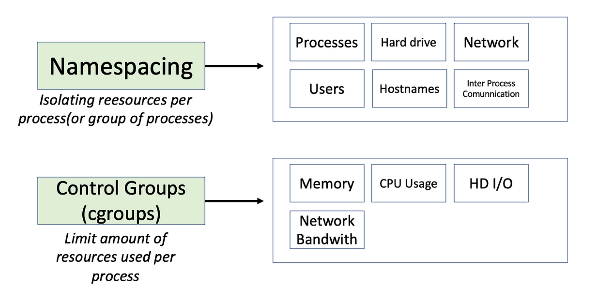

# 📚 스터디 템플릿

## 📖 1. 목차를 읽기 전에 든 생각
= 도커에 대해서 일반적으로 알고 있었지만 약간 와닿지 않는 개념들이 있을텐데, 복습하면서 가까워지기
- 부족했던 개념이나 정의를 확실하게 맞춰 가져가기

## 📝 2. 내용 정리

### 정의들

<table>
<tr>
    <td>단어</td>
    <td>정의</td>
</tr>
<tr>
    <td>셸</td>
    <td>운영체제와 사용자 사이에 위치. 명령어를 통해 운영체제와 상호작용함</td>
</tr>
<tr>
    <td>프로그램</td>
    <td>실행 가능한 명령어의 집합. 하드에는 올라가있지만 메로리에 올라가지 않은 정적인 상태</td>
</tr>
<tr>
    <td>프로세스</td>
    <td>실행중인 프로그램. 동적인 상태의 프로그램. 스레드의 컨테이너</td>
</tr>
<tr>
    <td>멀티 프로세스</td>
    <td>디스크에 존재하는 프로그램을 여러번 실행 ex : PPT 창 세개</td>
</tr>
<tr>
    <td>네임 스페이스</td>
    <td>프로세스를 실행할 때, 리소스를 분리해서 실행하도록 도와주는 기능</td>
</tr>
<tr>
    <td>컨테이너</td>
    <td>SW를 배포할 때 필요한 코드, 라이브러리 환경설정을 모아 격리시키고 실행 가능한 패키지로 만든 것 
    서로 다른 컨테이너는 격리되어 있으므로 서로 충돌하지 않는다.
    </td>
</tr>
<tr>
    <td>가상화</td>
    <td>컴퓨터에서 사용하는 리소스를 추상화하는 개념</td>
</tr>
</table>

### 호스트 가상화, 하이퍼바이저 가상화, 컨테이너 가상화 차이

#### 호스트 가상화
- 하이퍼바이저로 가상 머신을 만들고각 vm에는 게스트 운영체를 설치
- 하이버파이저 : 단일 물리 머신에서 다수의 가상 머신을 실행할 대 사용하는 sw
- os위에 os가 얹히는 구조

#### 하이퍼바이저 가상화
- 호스트 운영체제를 필요로 하지 않는 방식
- 부팅 시 가상머신을 선택
- 하드웨어에 hiper-v를 서맃해 사용

#### 컨테이너 가상화
- 도커를 설치 후 컨테이너를 통해 ap를 실행한다.
- 컨테이너간 격리로 다른 ap에 영향을 미치지 않음

### 도커의 시스템 콜 커널
chroot(Change Root Directory) - confied environment
- 현재 실행중인 프로세스와 차일드 프로세스 그룹에서 루트 디렉토리를 변경하는 작업
- 프로세스를 가두기 위해 사용 (루트 디렉토리 밖으로 프로세스가 나가도록 막기 위해)
- 유저에게는 루트인 것처럼 속임 (볼 수 있는 파일 정보 자체가 다르다.)

nameSpaces
- 프로세스의 환경을 격리하는 역할. 호스트에게 영향을 주지 않기 위해 개발
- 마운트 경로만 다르게 지정되는게 아니라 network경로, host name, 사용자 계정, pid도 다르게 보여준다.

Cgroup
- AP에게 하드웨어 리소스를 그룹으로 묶어서 할당하는 기술이다. (cpu, mem, disk, network)
- cgroup노드는 하위에 서버 노드를 가지고 있고, leaf-node는 프로세스가 된다.

union fileSystem
- 도커 컨테이너가 namespace와 cgroup에 격리될 때 컨테이너가 사용할 파일 시스템도 격리가 되어야 한다.
- unionfs는 서로 다른 파일 시스템이나 디렉토리를 합쳐 하나의 논리적 팡리 시스템으로 컨테이너에 제공 가능

## 💡 3. 전부 읽고 난 후기
- 프로세스, 프로그램, 스레드에 대해서 설명은 할 수 있었지만, 정확한 비유가 있으니 조금 더 잘 와닿는 느낌
- 그동안 항상 난제같았던 가상화의 차이, 그리고 OS레벨에 대한 통제 방식을 공부할 수 있어서 좋았음

## ❓ 4. 특별히 궁금했던 부분
1. OS레벨과 어떻게 연관되어 있을까?
https://www.youtube.com/watch?v=lVtgqmjv4BQ
2. 커널과 바이너리 파일의 역할

